# Pix2pix

Yet another TensorFlow implementation of pix2pix

Original paper: [Image-to-Image Translation with Conditional Adversarial Networks](https://arxiv.org/abs/1611.07004)

## Requirements

```
tensorflow_gpu==1.2.1
numpy==1.14.0
Pillow==5.0.0
imageio==2.2.0
```

## Usages

### Download  dataset

```bash
bash ./download_dataset.sh dataset_name
```

dataset_name := [`facades` | `cityscapes` | `maps` | `edges2shoes` | `edges2handbags`]

### Train

```bash
python main.py --phase train  --dataset_name facades
```

**Note:** Training model will generate a directory like `run-xxxxxx-xxxxxx`, which contains

- `checkpoint/`: save model checkpoint
- `summaries/`: save tensorflow summaries
- `log.txt`: save training log

### Test

```bash
python main.py --phase test  --dataset_name facades --prefix run-xxxxxxxx-xxxxxx
```
and the test results will be displayed in the `run-xxxxxxxx-xxxxxx/test/` directory

## Result

### facades

|input|target|output|
|:---:|:---:|:---:|
|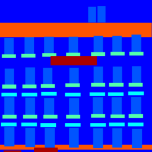||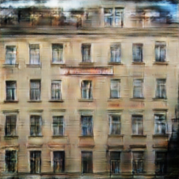|
|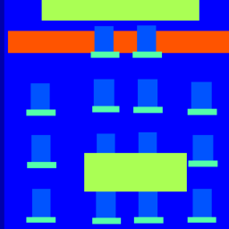||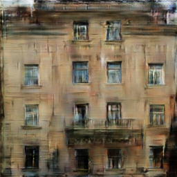|
|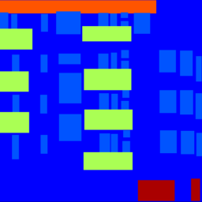|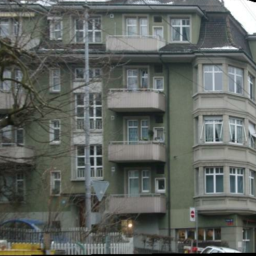|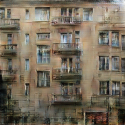|

---

### cityscapes

|input|target|output|
|:---:|:---:|:---:|
|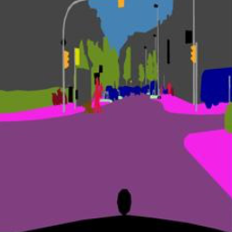||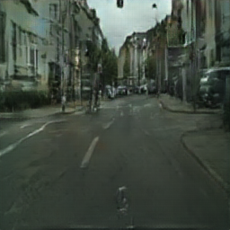|
|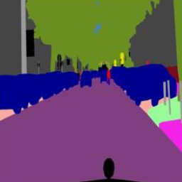|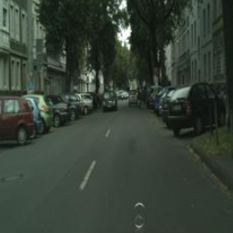|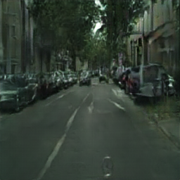|
|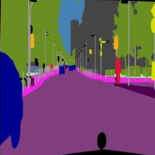|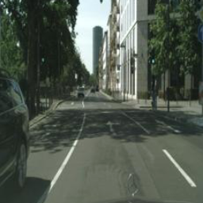|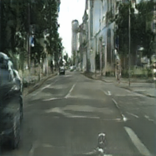|